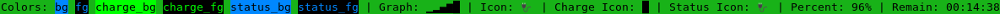
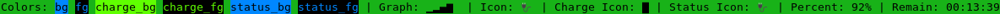
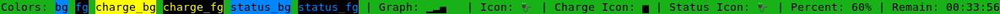
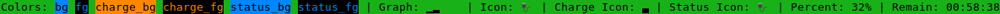
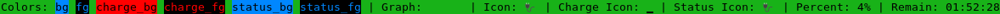
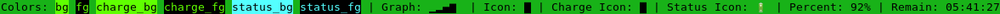
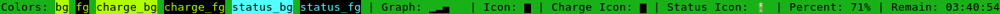

# Tmux battery status

Enables displaying battery percentage and status icon in tmux status-right.

## Installation

In order to read the battery status, this plugin depends on having one of the following applications installed:
- pmset (MacOS only)
- acpi
- upower
- termux-battery-status
- apm

In a normal situation, one of the above should be installed on your system by default and thus it should not be necessary to specifically install one of them. That being said, the `acpi` utility is currently recommended for use over `upower` where possible due to ongoing CPU usage issues.

### Installation with [Tmux Plugin Manager](https://github.com/tmux-plugins/tpm) (recommended)

Add plugin to the list of TPM plugins in `.tmux.conf`:

```tmux
set -g @plugin 'tmux-plugins/tmux-battery'
```

Hit `<prefix> + I` to fetch the plugin and source it.

If format strings are added to `status-right`, they should now be visible.

### Manual Installation

Clone the repo:

```shell
git clone https://github.com/tmux-plugins/tmux-battery ~/clone/path
```

Add this line to the bottom of `.tmux.conf`:

```tmux
run-shell ~/clone/path/battery.tmux
```

From the terminal, reload TMUX environment:

```shell
tmux source-file ~/.tmux.conf
```

If format strings are added to `status-right`, they should now be visible.

## Usage

Add any of the supported format strings (see below) to the `status-right` tmux option in `.tmux.conf`. Example:

```tmux
set -g status-right '#{battery_status_bg} Batt: #{battery_icon} #{battery_percentage} #{battery_remain} | %a %h-%d %H:%M '
```

### Supported Format Strings

 - `#{battery_color_bg}` - will set the background color of the status bar based on the battery charge level if discharging and status otherwise
 - `#{battery_color_fg}` - will set the foreground color of the status bar based on the battery charge level if discharging and status otherwise
 - `#{battery_color_charge_bg}` - will set the background color of the status bar based solely on the battery charge level
 - `#{battery_color_charge_fg}` - will set the foreground color of the status bar based solely on the battery charge level
 - `#{battery_color_status_bg}` - will set the background color of the status bar based solely on the battery status
 - `#{battery_color_status_fg}` - will set the foreground color of the status bar based solely on the battery status
 - `#{battery_graph}` - will show battery percentage as a bar graph: ▁▂▄▆█
 - `#{battery_icon}` - will display a battery status/charge icon
 - `#{battery_icon_charge}` - will display a battery charge icon
 - `#{battery_icon_status}` - will display a battery status icon
 - `#{battery_percentage}` - will show battery percentage
 - `#{battery_remain}` - will show remaining time of battery charge\*

\* These format strings can be further customized via options as described below.

#### Options

`#{battery_remain}`

 - `@batt_remain_short`: 'true' / 'false' - This will shorten the time remaining (when charging or discharging) to `~H:MM`.

### Defaults

#### Options

 - `@batt_remain_short`: 'false'

#### Icons/Colors

By default, the following colors and icons are used. (The exact colors displayed depends on your terminal / X11 config.)

Please be aware that the 'level of charge' as noted below (e.g. `[80%-95%)`) uses interval notation. If you are unfamiliar with it, <a href="https://en.wikipedia.org/wiki/Bracket_(mathematics)#Intervals">check it out here</a>.

Also, a note about the `@batt_color_...` options: `@batt_color_..._primary_...` options are what will be displayed in the main `bg` or `fg` format strings you choose - e.g. if you use `#{battery_color_bg}`, the `@batt_color_..._primary_...` colors you choose will be the background. Likewise, the corresponding `@batt_color_..._secondary_...` color will be the foreground.

Level of Charge Colors:

 - primary tier 8 \[95%-100%] (`@batt_color_charge_primary_tier8`): '#00ff00'
 - primary tier 7 \[80%-95%) (`@batt_color_charge_primary_tier7`): '#55ff00'
 - primary tier 6 \[65%-80%) (`@batt_color_charge_primary_tier6`): '#aaff00'
 - primary tier 5 \[50%-65%) (`@batt_color_charge_primary_tier5`): '#ffff00'
 - primary tier 4 \[35%-50%) (`@batt_color_charge_primary_tier4`): '#ffc000'
 - primary tier 3 \[20%-35%) (`@batt_color_charge_primary_tier3`): '#ff8000'
 - primary tier 2 (5%-20%) (`@batt_color_charge_primary_tier2`): '#ff4000'
 - primary tier 1 \[0%-5%] (`@batt_color_charge_primary_tier1`): '#ff0000'
 - secondary tier 8 \[95%-100%] (`@batt_color_charge_secondary_tier8`): 'colour0'
 - secondary tier 7 \[80%-95%) (`@batt_color_charge_secondary_tier7`): 'colour0'
 - secondary tier 6 \[65%-80%) (`@batt_color_charge_secondary_tier6`): 'colour0'
 - secondary tier 5 \[50%-65%) (`@batt_color_charge_secondary_tier5`): 'colour0'
 - secondary tier 4 \[35%-50%) (`@batt_color_charge_secondary_tier4`): 'colour0'
 - secondary tier 3 \[20%-35%) (`@batt_color_charge_secondary_tier3`): 'colour0'
 - secondary tier 2 (5%-20%) (`@batt_color_charge_secondary_tier2`): 'colour0'
 - secondary tier 1 \[0%-5%] (`@batt_color_charge_secondary_tier1`): 'colour0'

Status Colors:

 - primary charged (`@batt_color_status_primary_charged`): 'colour33'
 - primary charging (`@batt_color_status_primary_charging`): 'colour33'
 - primary discharging (`@batt_color_status_primary_discharging`): 'colour14'
 - primary attached (`@batt_color_status_primary_attached`): 'colour201'
 - primary unknown (`@batt_color_status_primary_unknown`): 'colour7'
 - secondary charged (`@batt_color_status_secondary_charged`): 'colour0'
 - secondary charging (`@batt_color_status_secondary_charging`): 'colour0'
 - secondary discharging (`@batt_color_status_secondary_discharging`): 'colour0'
 - secondary attached (`@batt_color_status_secondary_attached`): 'colour0'
 - secondary unknown (`@batt_color_status_secondary_unknown`): 'colour0'

Level of Charge Icons:

 - tier 8 \[95%-100%] (`@batt_icon_charge_tier8`): '█'
 - tier 7 \[80%-95%) (`@batt_icon_charge_tier7`): '▇'
 - tier 6 \[65%-80%) (`@batt_icon_charge_tier6`): '▆'
 - tier 5 \[50%-65%) (`@batt_icon_charge_tier5`): '▅'
 - tier 4 \[35%-50%) (`@batt_icon_charge_tier4`): '▄'
 - tier 3 \[20%-35%) (`@batt_icon_charge_tier3`): '▃'
 - tier 2 (5%-20%) (`@batt_icon_charge_tier2`): '▂'
 - tier 1 \[0%-5%] (`@batt_icon_charge_tier1`): '▁'

Status Icons:

 - charged (`@batt_icon_status_charged`): '🔌'
 - charged - OS X (`@batt_icon_status_charged`): '🔌'
 - charging (`@batt_icon_status_charging`): '🔌'
 - discharging (`@batt_icon_status_discharging`): '🔋'
 - attached (`@batt_icon_status_attached`): '⚠️'
 - unknown (`@batt_icon_status_unknown`): '?'

#### Changing the Defaults

All efforts have been made to make sane defaults, but if you wish to change any of them, add the option to `.tmux.conf`. For example:

```tmux
set -g @batt_icon_charge_tier8 '🌕'
set -g @batt_icon_charge_tier7 '🌖'
set -g @batt_icon_charge_tier6 '🌖'
set -g @batt_icon_charge_tier5 '🌗'
set -g @batt_icon_charge_tier4 '🌗'
set -g @batt_icon_charge_tier3 '🌘'
set -g @batt_icon_charge_tier2 '🌘'
set -g @batt_icon_charge_tier1 '🌑'
set -g @batt_icon_status_charged '🔋'
set -g @batt_icon_status_charging '⚡'
set -g @batt_icon_status_discharging '👎'
set -g @batt_color_status_primary_charged '#3daee9'
set -g @batt_color_status_primary_charging '#3daee9'
```

Don't forget to reload the tmux environment after you do this by either hitting `<prefix> + I` if tmux battery is installed via the tmux plugin manager, or by typing `tmux source-file ~/.tmux.conf` in the terminal if tmux battery is manually installed.

*Warning*: The battery icon change most likely will not be instant. When you un-plug the power cord, it will take some time (15 - 60 seconds) for the icon to change. This depends on the `status-interval` tmux option. Setting it to 15 seconds should be good enough.

## Examples

These are all examples of the default plugin color and icon schemes paired with the default tmux color scheme using the following `status-right` and `status-right-length` settings in `.tmux.conf`

```tmux
set -g status-right 'Colors: #{battery_color_bg}bg#[default] #{battery_color_fg}fg#[default] #{battery_color_charge_bg}charge_bg#[default] #{battery_color_charge_fg}charge_fg#[default] #{battery_color_status_bg}status_bg#[default] #{battery_color_status_fg}status_fg#[default] | Graph: #{battery_graph} | Icon: #{battery_icon} | Charge Icon: #{battery_icon_charge} | Status Icon: #{battery_icon_status} | Percent: #{battery_percentage} | Remain: #{battery_remain}'
set -g status-right-length '150'
```

Battery charging at tier 8 \[95%-100%]:<br>


Battery charging at tier 7 \[80%-95%):<br>


Battery charging at tier 6 \[65%-80%):<br>


Battery charging at tier 5 \[50%-65%):<br>


Battery charging at tier 4 \[35%-50%):<br>


Battery charging at tier 3 \[20%-35%):<br>


Battery charging at tier 2 (5%-20%):<br>


Battery charging at tier 1 \[0%-5%]:<br>


Battery discharging at tier 8 \[95%-100%]:<br>


Battery discharging at tier 7 \[80%-95%):<br>


Battery discharging at tier 6 \[65%-80%):<br>


Battery discharging at tier 5 \[50%-65%):<br>


Battery discharging at tier 4 \[35%-50%):<br>


Battery discharging at tier 3 \[20%-35%):<br>


Battery discharging at tier 2 (5%-20%):<br>


Battery discharging at tier 1 \[0%-5%]:<br>


Battery in 'attached' status:<br>


Battery in an unknown status:<br>


### Tmux Plugins

This plugin is part of the [tmux-plugins](https://github.com/tmux-plugins) organisation. Checkout plugins as [resurrect](https://github.com/tmux-plugins/tmux-resurrect), [logging](https://github.com/tmux-plugins/tmux-logging), [online status](https://github.com/tmux-plugins/tmux-online-status), and many more over at the [tmux-plugins](https://github.com/tmux-plugins) organisation page.

### Maintainer

 - [Martin Beentjes](https://github.com/martinbeentjes)

### Contributors

 - Adam Biggs
 - Aleksandar Djurdjic
 - Bruno Sutic
 - Caleb
 - Dan Cassidy
 - Diego Ximenes
 - Evan N-D
 - Jan Ahrens
 - Joey Geralnik
 - HyunJong (Joseph) Lee
 - Martin Beentjes
 - Mike Foley
 - Ryan Frantz
 - Seth Wright
 - Tom Levens

### License

[MIT](LICENSE.md)
